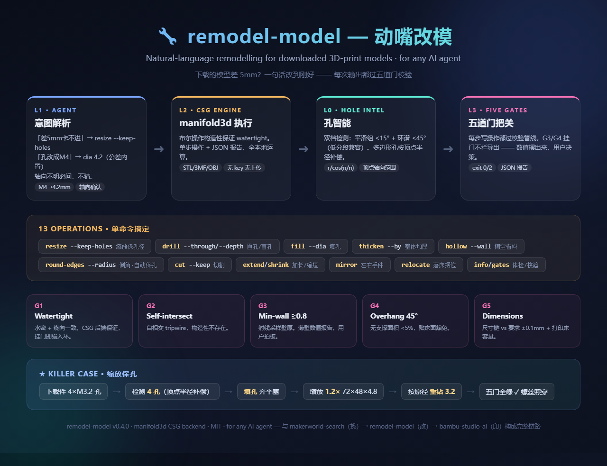

<p align="center">
  
</p>

# remodel-model

**Natural-language remodelling for downloaded 3D-print models (STL/3MF/OBJ) — for any AI agent.**

> Say *"this downloaded bracket is 5mm too short"* or *"把孔改成M4"* — the agent parses your intent, runs a single CSG operation via `remodel.py`, and hands you a validated file: watertight, wall-thickness-checked, overhang-checked, and dimension-verified against what you asked for.

## Why

Downloaded models almost fit. Community skills cover printer control and model search, but **editing an existing mesh is a 0-competitor niche** — and generic scaling breaks it: scale a part 1.2× and its M3 mounting holes become M3.6, and your screws no longer fit. This skill closes the gap:

- **L1 intent parsing** (the agent itself): operation type + parameters, with fit tolerances built in (M4 → 4.2mm hole)
- **L2 execution** (`remodel.py`): 13 operations on existing meshes, backed by [manifold3d](https://github.com/elalish/manifold) — boolean operations that constructively guarantee valid, watertight output
- **L0 hole intelligence** (built-in): automatic circular-hole detection on both smooth and low-poly meshes (two-tier: smooth-group + ring-spectrum), vertex-radius compensation for polygonal holes
- **L3 gatekeeping** (five gates): every write op is validated — watertight / self-intersection / min-wall / overhang (45° rule) / dimension-chain vs. request

The killer feature: **`resize --keep-holes`** — scale the part, keep every hole at its original diameter (fill → scale → re-drill, so no crescent slivers), because 99% of resizes are "make it fit" and the holes still need to match their screws.

## Install

Works with any agent that reads the [Agent Skills](https://github.com/anthropics/skills) convention (Claude Code, OpenClaw, Cursor, Hermes, …). Drop the folder into your agent's skills directory, then:

```bash
pip install manifold3d trimesh numpy scipy rtree
```

No API keys. No login. No printer required.

## Usage

```bash
# inspect: dimensions, volume, mass, auto-detected holes (dia/axis/depth)
python3 scripts/remodel.py info part.stl
# resize 1.2x but keep every hole at its original diameter
python3 scripts/remodel.py resize part.stl --factor 1.2 --keep-holes -o out.stl
# resize to exact dims, holes preserved
python3 scripts/remodel.py resize part.stl --size 40x20x5 --keep-holes -o out.stl
# drill through-hole (M4) / blind hole
python3 scripts/remodel.py drill part.stl --at 30,20,0 --dia 4.2 --through -o out.stl
python3 scripts/remodel.py drill part.stl --at 30,20,4 --dia 8 --depth 2 -o out.stl
# fill holes (all, or only ≤ a diameter)
python3 scripts/remodel.py fill part.stl -o out.stl
# thicken / hollow / round edges (holes auto-protected)
python3 scripts/remodel.py thicken part.stl --by 1 -o out.stl
python3 scripts/remodel.py hollow part.stl --wall 2 --open-bottom -o out.stl
python3 scripts/remodel.py round-edges part.stl --radius 1.5 -o out.stl
# cut / extend / shrink / mirror / relocate
python3 scripts/remodel.py cut part.stl --at z=10 --keep top -o out.stl
python3 scripts/remodel.py extend part.stl --axis z --by 8 -o out.stl
python3 scripts/remodel.py mirror part.stl --axis x -o out.stl
# validate any model against the five gates
python3 scripts/remodel.py gates part.stl
```

The agent side of the protocol (L1 intent rules, L3 gate-report interpretation, fit-tolerance tables) lives in [SKILL.md](SKILL.md).

## The five gates

Every write operation runs the same validation pipeline and returns a JSON report:

| Gate | Checks | On failure |
|---|---|---|
| G1 watertight | watertight + winding-consistent | Input mesh was broken — repair or re-source |
| G2 self-intersect | tripwire (CSG output is valid by construction) | Same as G1 |
| G3 min-wall | ray-sampled wall thickness ≥ 0.8mm | Report the number; thin walls are the user's call |
| G4 overhang | >45° unsupported area < 5% (bed faces excluded) | Suggest supports or reorientation |
| G5 dimensions | final bbox vs. request (±0.1mm) and vs. printer bed | Always fatal if over bed |

**Gate semantics**: G3/G4 failures don't block the export — the file is written, exit code 2, and the report tells the agent exactly which gate tripped and by how much. Thin walls and overhangs are user decisions; the skill's job is to surface the numbers.

## Verified runs

| Case | Result |
|---|---|
| Resize 1.2× + keep-holes (plate, 4×M3.2) | 72×48×4.8 exact; holes 3.209 ≈ 3.2 preserved; all 5 gates green |
| Round-edges 1.5mm (same plate) | Holes auto-protected via fill→close→re-drill; all gates green |
| Hollow wall 0.4mm (negative case) | G3 correctly intercepted (min_wall 0.4 < 0.8) — the gates are real |
| Full regression | 13 ops + 3 negative cases, 16/16 green |

## Technical notes (from the debugging trail)

- Two-tier hole detection: smooth meshes group at <15° dihedral; low-poly cylinder walls breach that (default-segment walls sit at exactly 30°), so a second tier groups at <45° and qualifies rings by **normal-angle spectrum** (face-center spectra have phantom gaps on low-seg meshes).
- Polygonal holes: the least-squares fit returns the inradius; the true vertex radius is `r_fit / cos(π/n)`. Re-drills use vertex radius, fill plugs get +3%, or crescent slivers remain.
- Hole axial extent comes from wall **vertices**, not face centers (low-seg wall quads split into two tris whose centers sit at two z-levels, under-reporting the span by a third).
- `man_to_tri` must use `process=False` — trimesh's default `merge_vertices` welds near-coincident verts at absolute tolerance and **tears the manifold open** on dense minkowski output (observed: 11784 faces → non-watertight).
- Through-hole counting: use trimesh `euler_number` (2−2·genus); manifold3d's `genus()` returns CSG-internal genus, which reads 0 for a drilled cylinder.
- Morphological thicken/round-edges shrink or close holes by construction — keep-holes is the default for `round-edges`, three-step fill → operate → re-drill.

## Provenance & compliance

- Geometry backend is [manifold3d](https://github.com/elalish/manifold) (Apache-2.0), the boolean engine behind DUST3D/many CAD tools — all CSG operations are local, no uploads.
- Hole detection, gates, and the CLI are original code for this skill.
- Fit tolerances (M-series +0.2mm, press/slip/clearance) follow community FDM practice, table in the agent protocol.

## License

MIT — see [SKILL.md](SKILL.md) frontmatter. Backend credit: manifold3d / trimesh.

---

# remodel-model（中文说明）

**给任何 AI agent 用的下载模型改模 skill。**

> 说「下载的挂架差 5mm 卡不进」或「把孔改成 M4」—— agent 解析意图，跑一次 CSG 操作，交给你一个**验证过的**文件：watertight、壁厚检查、悬垂检查、尺寸链核对。

## 为什么做这个

下载的模型总是差一点。社区 skill 全是打印控制和模型搜索，**改已有网格是空白赛道**——而朴素缩放会把它改坏：放大 1.2 倍，M3 安装孔变 M3.6，螺丝穿不进了。这个 skill 补上这个缺口：

- **L1 意图解析**（agent 自己做）：操作类型 + 参数，公差内置（M4 → 4.2mm 孔）
- **L2 执行**（`remodel.py`）：13 种操作，[manifold3d](https://github.com/elalish/manifold) 后端——布尔操作构造性保证输出有效、watertight
- **L0 孔智能**（脚本内置）：光滑网格和低分段网格都能自动检测圆孔（双档：平滑组 + 环谱），多边形孔按顶点半径补偿
- **L3 把关**（五道门）：每次写操作都过——watertight / 自相交 / 最小壁厚 / 悬垂（45° 规则）/ 尺寸链 vs 要求

杀手级功能：**`resize --keep-holes`**——缩放零件，孔径保持原样（填孔→缩放→重钻三步法，无月牙残环），因为 99% 的缩放是「让它装得下」，孔还是要配螺丝的。

## 安装

适配任何遵循 [Agent Skills](https://github.com/anthropics/skills) 约定的 agent（Claude Code、OpenClaw、Cursor、Hermes 等）。把本目录放进你 agent 的 skills 目录，然后：

```bash
pip install manifold3d trimesh numpy scipy rtree
```

无需 API key。无需登录。无需打印机。

## 用法

```bash
# 看信息：尺寸、体积、质量、自动检孔（孔径/轴向/深度）
python3 scripts/remodel.py info part.stl
# 缩放 1.2 倍，孔径保持不变
python3 scripts/remodel.py resize part.stl --factor 1.2 --keep-holes -o out.stl
# 缩放到精确尺寸，保孔
python3 scripts/remodel.py resize part.stl --size 40x20x5 --keep-holes -o out.stl
# 打通孔（M4）/ 盲孔
python3 scripts/remodel.py drill part.stl --at 30,20,0 --dia 4.2 --through -o out.stl
python3 scripts/remodel.py drill part.stl --at 30,20,4 --dia 8 --depth 2 -o out.stl
# 填孔（全部 / 只填 ≤ 某直径）
python3 scripts/remodel.py fill part.stl -o out.stl
# 加厚 / 掏空 / 倒圆角（孔自动保护）
python3 scripts/remodel.py thicken part.stl --by 1 -o out.stl
python3 scripts/remodel.py hollow part.stl --wall 2 --open-bottom -o out.stl
python3 scripts/remodel.py round-edges part.stl --radius 1.5 -o out.stl
# 切割 / 加高 / 缩短 / 镜像 / 摆位
python3 scripts/remodel.py cut part.stl --at z=10 --keep top -o out.stl
python3 scripts/remodel.py extend part.stl --axis z --by 8 -o out.stl
python3 scripts/remodel.py mirror part.stl --axis x -o out.stl
# 对任意模型跑五道门
python3 scripts/remodel.py gates part.stl
```

协议中 agent 侧的部分（L1 意图规则、L3 报告解读、公差表）在 [SKILL.md](SKILL.md)。

## 五道门

每次写操作都跑同一条校验管线，返回 JSON 报告：

| 门 | 查什么 | 挂了怎么办 |
|---|---|---|
| G1 watertight | watertight + 绕向一致 | 输入网格本来就坏——修复或换源 |
| G2 自相交 | tripwire（CSG 输出构造性有效） | 同 G1 |
| G3 最小壁厚 | 射线采样壁厚 ≥ 0.8mm | 报数值；薄壁是用户的决策 |
| G4 悬垂 | >45° 无支撑面积 < 5%（排除贴床面） | 建议开支撑或调向 |
| G5 尺寸链 | 最终 bbox vs 要求（±0.1mm）+ 不超打印床 | 超床必失败 |

**门的语义**：G3/G4 挂了不拦导出——文件照常写，exit code 2，报告告诉 agent 哪道门挂了、差多少。薄壁和悬垂是用户的决策空间；skill 的职责是把数值摆出来。

## 实测记录

| 案例 | 结果 |
|---|---|
| 缩放 1.2× + 保孔（板件，4×M3.2） | 72×48×4.8 精确；孔径 3.209 ≈ 3.2 保留；五门全绿 |
| 倒圆角 1.5mm（同板件） | 孔自动保护（填→closing→重钻）；五门全绿 |
| 掏空壁厚 0.4mm（反例） | G3 精确拦截（min_wall 0.4 < 0.8）——门是真门 |
| 全量回归 | 13 操作 + 3 反例，16/16 通过 |

## 技术笔记（调试图鉴）

- 双档孔检测：光滑网格按 <15° 二面角分组；低分段圆柱壁会击穿这个阈值（默认分段的壁相邻面偏差恰 30°），第二档按 <45° 分组并用**法向角谱**判环（面心角谱在低分段下有假间隙）。
- 多边形孔：最小二乘拟合给内接半径；真实顶点半径是 `r_fit / cos(π/n)`。重钻用顶点半径，填孔塞子 +3%，否则留月牙残环。
- 孔的轴向范围取**顶点集**，不是面心集（低分段壁的 quad 切成 2 个三角形，面心 z 坐标分两层，面心范围比真实孔短三分之一）。
- `man_to_tri` 必须 `process=False`——trimesh 默认的 merge_vertices 按绝对容差焊接，在致密 minkowski 输出上**撕裂流形**（实测 11784 面 → non-watertight）。
- 通孔计数用 trimesh `euler_number`（2−2×genus）；manifold3d 的 `genus()` 返回 CSG 内部 genus，钻孔圆柱读 0。
- 形态学加厚/倒角天然缩孔填孔——`round-edges` 默认保孔（填→操作→重钻三步法）。

## 出处与合规

- 几何后端 [manifold3d](https://github.com/elalish/manifold)（Apache-2.0），DUST3D 等工具的布尔引擎——全部 CSG 操作本地执行，不上传。
- 孔检测、五道门、CLI 为本 skill 原创代码。
- 配合公差（M 系 +0.2mm、压入/滑动/自由间隙）遵循 FDM 社区惯例，表在 agent 协议里。

## 许可

MIT — 见 [SKILL.md](SKILL.md) frontmatter。后端致谢：manifold3d / trimesh。